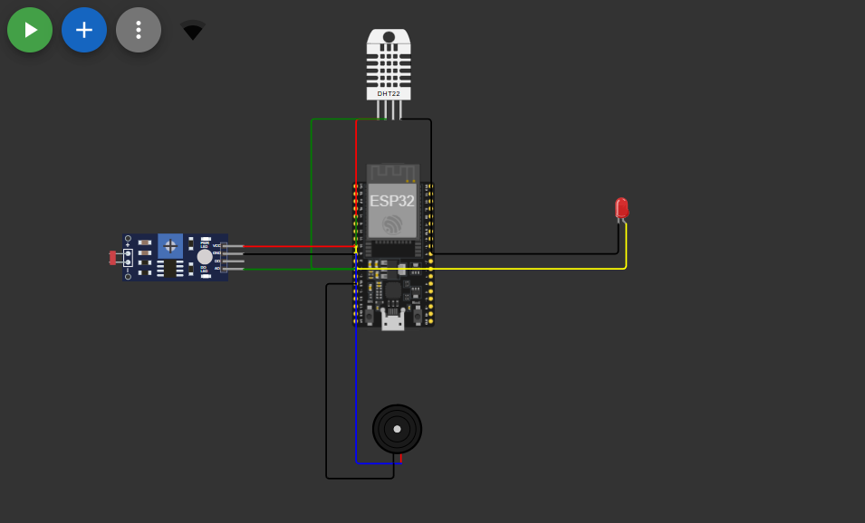
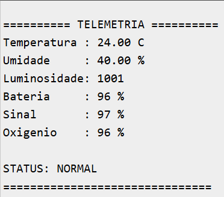
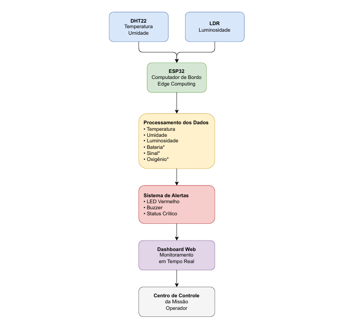
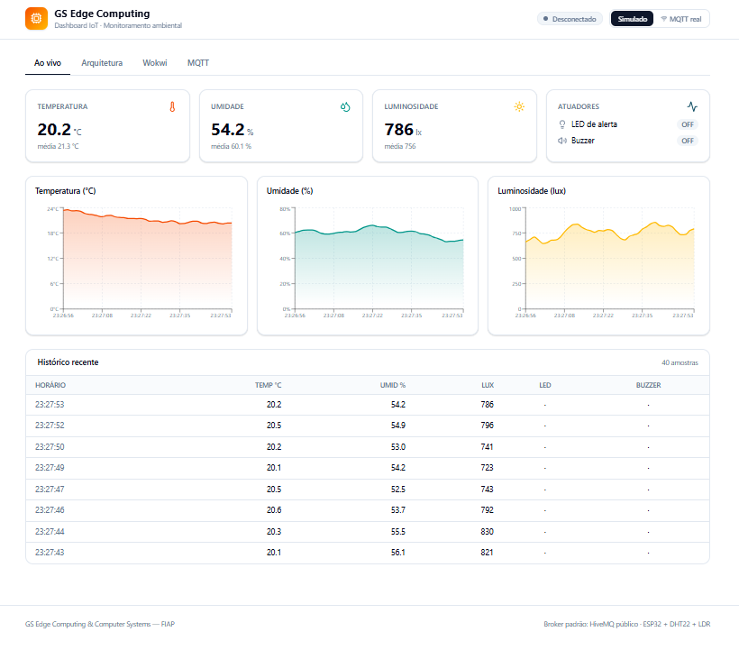

# GS_Edge_Computing_Computer_Systems
Projeto GS de Edge Computing &amp; Computer Systems. Sistema de telemetria da cápsula Dragon da SpaceX utilizando ESP32, DHT22, sensor de luminosidade, MQTT e Edge Computing.

# 🚀 Dragon Telemetry System

### GS - Edge Computing & Computer Systems


---

## 📖 Sobre o Projeto

O Dragon Telemetry System é uma solução de telemetria baseada em Edge Computing desenvolvida para monitorar parâmetros críticos de uma cápsula espacial inspirada na Dragon da SpaceX.

O sistema utiliza sensores conectados ao ESP32 para coletar dados ambientais em tempo real, processar informações localmente e transmitir telemetria através do protocolo MQTT.

---

## 🎯 Objetivo

Monitorar continuamente as condições operacionais da cápsula e gerar alertas automáticos quando situações críticas forem detectadas.

---

## 🛰️ Parâmetros Monitorados

| Parâmetro | Tipo |
|------------|---------|
| Temperatura | Real |
| Umidade | Real |
| Luminosidade | Real |
| Bateria | Simulado |
| Sinal de Comunicação | Simulado |
| Oxigênio | Simulado |

---

## ⚡ Edge Computing

O processamento é realizado diretamente no ESP32.

### Regras de Alerta

- Temperatura > 35°C
- Umidade < 20%
- Luminosidade < 500
- Bateria < 85%
- Sinal < 75%
- Oxigênio < 92%

Quando uma condição crítica é detectada:

✅ LED Vermelho acionado

✅ Buzzer acionado

✅ Alerta exibido no Monitor Serial

---

## 🏗️ Arquitetura da Solução

```text
Sensores
   ↓
ESP32
(Edge Computing)
   ↓
MQTT
   ↓
Broker HiveMQ
   ↓
FIWARE
   ↓
Dashboard
   ↓
Centro de Controle
```

---

## 📡 Comunicação MQTT

### Broker

```text
broker.hivemq.com
```

### Tópicos

```text
spacex/dragon/temperatura
spacex/dragon/umidade
spacex/dragon/luminosidade
spacex/dragon/bateria
spacex/dragon/sinal
spacex/dragon/oxigenio
```

---

## 🛠️ Tecnologias Utilizadas

- ESP32
- Wokwi
- MQTT
- PubSubClient
- DHT22
- Photoresistor Sensor
- Edge Computing
- IoT

---

## 📷 Circuito



## 📟 Monitor Serial




## 🏗️ Arquitetura



## 📊 Dashboard

Dashboard desenvolvido em HTML, CSS e JavaScript para monitoramento em tempo real dos dados de telemetria.



## 🔗 Simulação Wokwi

[https://wokwi.com/projects/SEU_PROJETO](https://wokwi.com/projects/466215378649175041)

## 🔗 Repositório GitHub

https://github.com/Ven900/GS_Edge_Computing_Computer_Systems

---

## 📂 Estrutura do Projeto

```text
GS_Edge_Computing_Computer_Systems
│
├── README.md
│
├── imagens
│   ├── circuito-wokwi.png
│   ├── monitor-serial.png
│   ├── dashboard.png
│   └── arquitetura.png
│
└── dashboard.html
```

---

## 👨‍💻 Autor

Bruno Ventura RM 568316
 
Diogo Henrique RM 568541
 
Giovanna P Zagaroli RM 567572
 
Venicio RM 568088
 
Vinicius Nathan RM 567105

GS - Edge Computing & Computer Systems

FIAP
